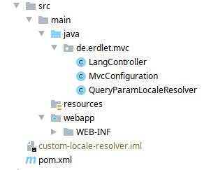

## Implementierung eigener LocaleResolver mit der MVC API
Zum Auslesen der `Locale` eines jeden Requests stellt die MVC API das Interface `LocaleResolver` bereit. Die Spezifikation
setzt zudem für jede Implementierung der API voraus, dass eine Standardimplementierung des `LocaleResolver`s vorliegt, welcher
die zu verwendende `Locale` aus dem HTTP-Header `Accept-Language` ausliest.

Das folgene Beispiel zeigt, wie man durch eine eigene Implementierung des `LocaleResolver`s die Möglichkeiten zum
auslesen der `Locale` erweitert. Konkret soll die `Locale` aus einem Query-Parameter der URL ausgelesen werden und
bei Fehlen über den Standard-`LocaleResolver` bezogen werden.

### Voraussetzungen
- Application-Server
- Java EE 8
- MVC API 1.0
- Eclipse Krazo (für entsprechenden Application Server)
- Maven

### Projektaufbau
Für das Beispiel wird eine einfache Webanwendung verwendet. Das Projektlayout dafür sieht folgendermaßen aus:



Dazu kommen noch die benötigten Abhängigkeiten in Maven:

```xml
<repositories>
    <repository>
        <id>sonatype-oss-snapshots</id>
        <url>https://oss.sonatype.org/content/repositories/snapshots</url>
        <releases>
            <enabled>false</enabled>
        </releases>
        <snapshots>
            <enabled>true</enabled>
        </snapshots>
    </repository>
</repositories>

<dependencies>

    <dependency>
      <groupId>javax.mvc</groupId>
      <artifactId>javax.mvc-api</artifactId>
      <version>{{versions.spec.latest}}</version>
    </dependency>

    <!-- Change if your application server doesn't use Jersey -->
    <dependency>
      <groupId>org.eclipse.krazo</groupId>
      <artifactId>krazo-jersey</artifactId>
      <version>{{versions.krazo.latest}}</version>
    </dependency>

    <dependency>
      <groupId>javax</groupId>
      <artifactId>javaee-api</artifactId>
      <version>8.0</version>
      <scope>provided</scope>
    </dependency>
  </dependencies>
```
**Achtung**: Das Projekt wurde auf Payara 5 implementiert und nutzt daher die Jersey-Implementierung
von Eclipse Krazo. Für Wildfly oder OpenLiberty / TomEE bitte die entsprechenden Artefakte benutzen.

### Implementierung des LocaleResolvers
#### MvcConfigurtion und LangController
Die Anwendung verwendet eine "leere" JAX-RS Anwendung und einen Controller, welcher in seiner einzigen Methode das
Template `index.jsp` zurückgibt. Dies funktioniert analog zum *Hello World* Beispiel und wird daher nicht näher erläutert.

Das Template `index.jsp` zeigt dem Benutzer jeweils die im Request gesetzte `Locale` an:

```jsp
<%@ page contentType="text/html;charset=UTF-8" language="java" %>

<html>
<head>
    <title>I18n Index</title>
</head>
<body>
<div id="locale">
    Request locale: <span>${mvc.locale}</span>
</div>
</body>
</html>

```

#### Der QueryParamLocaleResolver
Zum Auslesen der `Locale` aus einem Query-Paramter wird der `QueryParamLocaleResolver` entwickelt. Dieser implementiert das
`LocaleResolver` Interface der MVC API und wird direkt hinter der Standardimplementierung priorisiert. Zur Auswertung der `LocaleResolver` werden die
Implementierungen dann in umgekehrter Reihenfolge ausgewertet, damit die selbstentwickelten `LocaleResolver` immer Vorrang haben. 

```java
/**
 * Resolver to get the {@link Locale} to use from the requests query param <i>lang</i>.
 *
 * In case there is no request param with this name, the {@link Locale} will be resolved
 * by a higher prioritised implementation.
 *
 * Example usage:
 * <pre>
 * {@code
 * # Use default locale
 * curl -X GET <your-url>
 *
 * # Set german locale by query param
 * curl -X GET <your-url>?lang=de-DE
 * }
 * </pre>
 * @author Tobias Erdle
 */
@Priority(1)
@ApplicationScoped
public class QueryParamLocaleResolver implements LocaleResolver {

  @Override
  public Locale resolveLocale(final LocaleResolverContext context) {
    final var queryLang = context.getUriInfo()
        .getQueryParameters()
        .getFirst("lang");
    return queryLang != null ? Locale.forLanguageTag(queryLang) : null;
  }
}
```

#### Benutzung des QueryParamLocaleResolvers
Ruft man nun eine URL mit dem `lang` Query-Paramter und einer entsprechenden Locale auf, wird diese
entsprechend in den `MvcContext` gesetzt.

*curl -X GET http://\<your-url\>*
```html
<html>
<head>
    <title>I18n Index</title>
</head>
<body>
<div id="locale">
    <!-- en_US ist Standard Locale des Autors -->
    Request locale: en_US
</div>
</body>
</html>

```

*curl -X GET http://\<your-url\>?lang=de-DE*
```html
<html>
<head>
    <title>I18n Index</title>
</head>
<body>
<div id="locale">
    Request locale: de_DE
</div>
</body>
</html>

```

*curl -X GET http://\<your-url\>?lang=fr*
```html
<html>
<head>
    <title>I18n Index</title>
</head>
<body>
<div id="locale">
    Request locale: fr
</div>
</body>
</html>

```

### Weitere Quellen
- [MVC Spezifikation](https://oss.sonatype.org/service/local/repositories/snapshots/content/javax/mvc/javax.mvc-api/1.0-SNAPSHOT/javax.mvc-api-1.0-20190530.105420-89-spec.pdf)
- [Beispielprojekt](https://github.com/erdlet/mvc-international-example/tree/master/custom-locale-resolver)