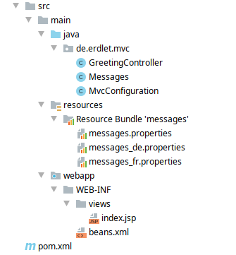

## Internationalisierung mit der MVC API 1.0
Beinahe jede größere Anwendung muss über kurz oder lang mehrere Sprachen unterstützen. Wie man dieses Ziel mit der MVC API 1.0 erreichen kann, wird im Folgenden anhand eines Beispiels beschrieben.

### Grundlagen der Internationalisierung in der API
In MVC 1.0 kann über `MvcContext#getLocale()` für jeden Request die verwendete `Locale` abgerufen werden. Diese
wird standardmäßig vom Standard-`LocaleResolver` der verwendeten Implementierung aus dem HTTP-Header `Accept-Language`
ausgelesen. Fehlt der Header, wird der Systemstandard der `Locale` verwendet.

### Voraussetzungen
- Application-Server
- Java EE 8
- MVC API 1.0
- Eclipse Krazo (für entsprechenden Application Server)
- Maven

### Projektaufbau
Für das Beispiel wird eine einfache Webanwendung verwendet. Das Projektlayout dafür sieht folgendermaßen aus:



Dazu kommen noch die benötigten Abhängigkeiten in Maven:

```xml
<repositories>
    <repository>
        <id>sonatype-oss-snapshots</id>
        <url>https://oss.sonatype.org/content/repositories/snapshots</url>
        <releases>
            <enabled>false</enabled>
        </releases>
        <snapshots>
            <enabled>true</enabled>
        </snapshots>
    </repository>
</repositories>

<dependencies>

    <dependency>
      <groupId>javax.mvc</groupId>
      <artifactId>javax.mvc-api</artifactId>
      <version>1.0-pfd</version>
    </dependency>

    <!-- Change if your application server doesn't use Jersey -->
    <dependency>
      <groupId>org.eclipse.krazo</groupId>
      <artifactId>krazo-jersey</artifactId>
      <version>1.0.0-SNAPSHOT</version>
    </dependency>

    <dependency>
      <groupId>javax</groupId>
      <artifactId>javaee-api</artifactId>
      <version>8.0</version>
      <scope>provided</scope>
    </dependency>
  </dependencies>
```
**Achtung**: Das Projekt wurde auf Payara 5 implementiert und nutzt daher die Jersey-Implementierung
von Eclipse Krazo. Für Wildfly oder OpenLiberty / TomEE bitte die entsprechenden Artefakte benutzen.

Die später verwendeten Übersetzungen für die Anwendung sind in den jeweiligen `messages.properties` abgelegt:

**messages.properties**
```
greeting=Hello!
farewell=Good bye!
```

**messages_de.properties**
```
greeting=Hallo!
```

**messages_fr.properties**
```
greeting=Bonjour!
```

### Implementierung der Internationalisierung
#### MvcConfigurtion und GreetingController
Die Anwendung verwendet eine "leere" JAX-RS Anwendung und einen Controller, welcher in seiner einzigen Methode das
Template `index.jsp` zurückgibt. Dies funktioniert analog zum *Hello World* Beispiel und wird daher nicht näher erläutert.

#### Die Messages-Klasse
Ausgangspunkt dieses Ansatzes zur Internationalisierung von MVC Anwendungen ist die Klasse `Messages`. Diese bietet eine einzelne
Methode `get(String)`, welche anhand des Keys eines in der `messages_XYZ.properties` gesetzten Key-Value Paares die korrekte 
Übersetzung laden soll.

```java
/**
 * Provides I18n messages for the UI per request. To get the correct locale, the method {@link MvcContext#getLocale()} is used.
 * This method uses the built-in {@link javax.mvc.locale.LocaleResolver} of the used MVC Implementation.
 *
 * @author Tobias Erdle
 * @see MvcContext#getLocale()
 * @see javax.mvc.locale.LocaleResolver
 */
@RequestScoped
@Named("msg")
public class Messages {

  private static final String BASE_NAME = "messages";

  @Inject
  private MvcContext mvcContext;

  /**
   * Get the assigned message to some key based on the {@link java.util.Locale} of the current request.
   *
   * @param key the message key to use
   * @return the correct translation assigned to the key for the request locale, a fallback translation or
   * a placeholder for unknown keys.
   */
  public final String get(final String key) {
    final var bundle = ResourceBundle.getBundle(BASE_NAME, mvcContext.getLocale());

    return bundle.containsKey(key) ? bundle.getString(key) : formatUnknownKey(key);
  }

  private static String formatUnknownKey(final String key) {
    return String.format("???%s???", key);
  }
}
```

Da die Klasse mit `@Named` annotiert ist, kann sie direkt in MVC Templates verwendet werden (sofern die `ViewEngine` CDI unterstützt). Da
die die `ViewEngine` für JSPs dies kann, wird die `Messages` Klassen im Beispieltemplate folgend aufgerufen:

```html
<%@ page contentType="text/html;charset=UTF-8" language="java" %>
<html>
<head>
    <title>I18n Index</title>
</head>
<body>
<div id="known-message">
    <p>${msg.get("greeting")}</p>
</div>

<div id="fallback-message">
    <p>${msg.get("farewell")}</p>
</div>

<div id="unknown-message">
    <p>${msg.get("something-unknown")}</p>
</div>
</body>
</html>

```

Bei jedem Aufruf zu `get(String)` wird nun das passende `ResourceBundle` für die im Request vorkommende `Locale` geladen und nach
einer Übersetzuungen für den angegebenen Schlüssel durchsucht. Wird der Schlüssel, aber keine auf die verwendete `Locale` passende Resource
gefunden, wird auf die `messages.properties` der Default-`Locale` oder die allgemeine `messages.properties` zurückgegriffen.

Führt man das Beispiel nun mit verschiedenen `Locale`s aus, bekommt man entsprechend der `messages.properties` folgende HTML-Seiten:

*curl -X GET http://localhost:8080/mvc-language-examples/mvc/greeting -H 'Accept-Language: en'*
```html
<%@ page contentType="text/html;charset=UTF-8" language="java" %>
<html>
<head>
    <title>I18n Index</title>
</head>
<body>
<div id="known-message">
    <p>Hello!</p>
</div>

<div id="fallback-message">
    <p>Good bye!</p>
</div>

<div id="unknown-message">
    <p>???something-unknown???</p>
</div>
</body>
</html>

```

*curl -X GET http://localhost:8080/mvc-language-examples/mvc/greeting -H 'Accept-Language: de'*
```html
<%@ page contentType="text/html;charset=UTF-8" language="java" %>
<html>
<head>
    <title>I18n Index</title>
</head>
<body>
<div id="known-message">
    <p>Hallo!</p>
</div>

<div id="fallback-message">
    <p>Good bye!</p>
</div>

<div id="unknown-message">
    <p>???something-unknown???</p>
</div>
</body>
</html>

```

*curl -X GET http://localhost:8080/mvc-language-examples/mvc/greeting -H 'Accept-Language: fr'*
```html
<%@ page contentType="text/html;charset=UTF-8" language="java" %>
<html>
<head>
    <title>I18n Index</title>
</head>
<body>
<div id="known-message">
    <p>Bonjour!</p>
</div>

<div id="fallback-message">
    <p>Good bye!</p>
</div>

<div id="unknown-message">
    <p>???something-unknown???</p>
</div>
</body>
</html>

```